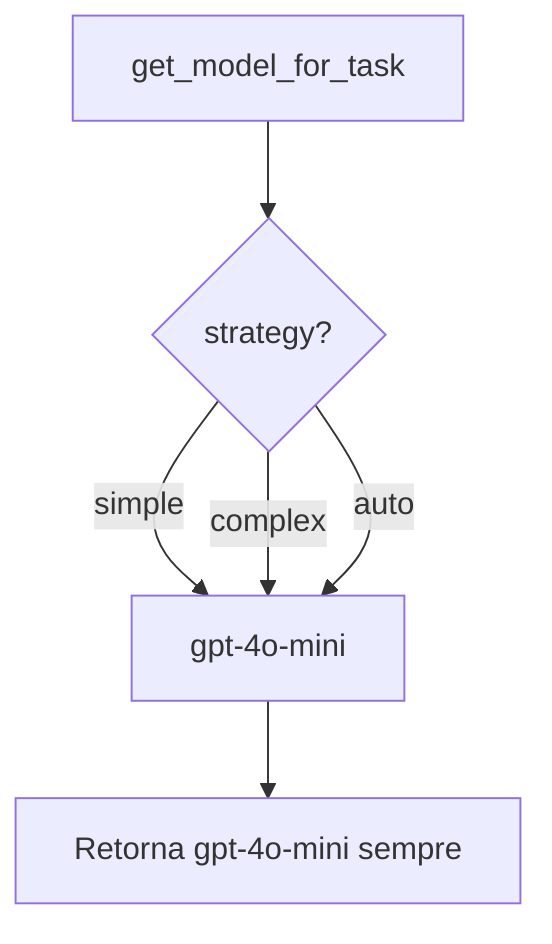
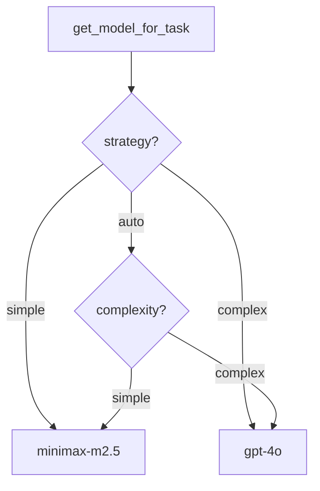

# Fluxograma — Config & Model Selection

> Gerado pelo Arqueólogo em 2026-05-11

## Carregamento de Configuração

```mermaid
flowchart TD
    A[Importa config.py] --> B[load_dotenv do .env]
    B --> C[Instancia Settings]
    C --> D[@lru_cache get_settings]
    D --> E[Singleton disponível]
```

## Seleção de Modelo (Implementação Real)



## Seleção de Modelo (Design Pretendido — não implementado)


