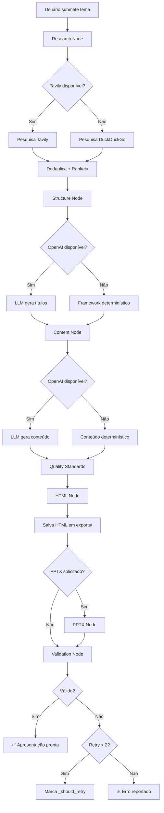
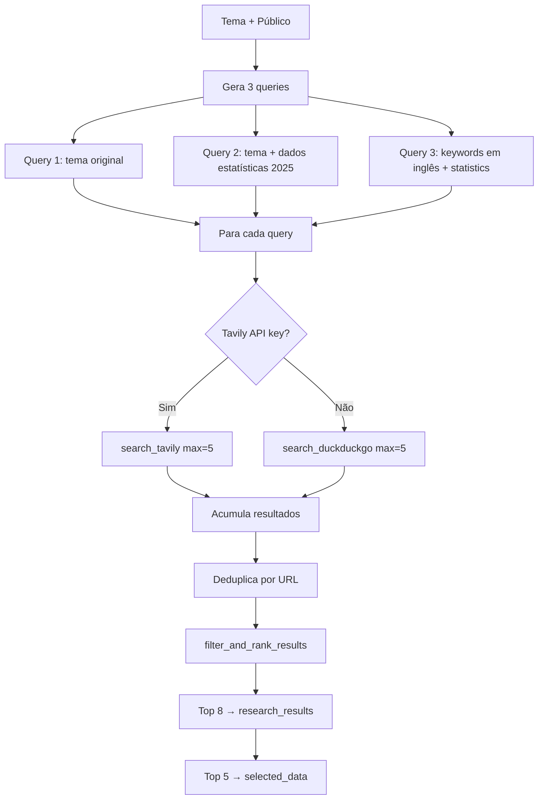
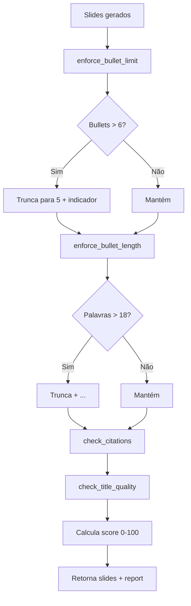

# Fluxograma — Pipeline de Geração

> Gerado pelo Arqueólogo em 2026-05-11

## Fluxo Principal

```mermaid
flowchart TD
    A[Usuário submete tema] --> B[Research Node]
    B --> C{Tavily disponível?}
    C -->|Sim| D[Pesquisa Tavily]
    C -->|Não| E[Pesquisa DuckDuckGo]
    D --> F[Deduplica + Rankeia]
    E --> F
    F --> G[Structure Node]
    G --> H{OpenAI disponível?}
    H -->|Sim| I[LLM gera títulos]
    H -->|Não| J[Framework determinístico]
    I --> K[Content Node]
    J --> K
    K --> L{OpenAI disponível?}
    L -->|Sim| M[LLM gera conteúdo]
    L -->|Não| N[Conteúdo determinístico]
    M --> O[Quality Standards]
    N --> O
    O --> P[HTML Node]
    P --> Q[Salva HTML em exports/]
    Q --> R{PPTX solicitado?}
    R -->|Sim| S[PPTX Node]
    R -->|Não| T[Validation Node]
    S --> T
    T --> U{Válido?}
    U -->|Sim| V[✅ Apresentação pronta]
    U -->|Não| W{Retry < 2?}
    W -->|Sim| X[Marca _should_retry]
    W -->|Não| Y[⚠️ Erro reportado]
```

## Research Node — Detalhamento

```mermaid
flowchart TD
    A[Tema + Público] --> B[Gera 3 queries]
    B --> B1[Query 1: tema original]
    B --> B2[Query 2: tema + dados estatísticas 2025]
    B --> B3[Query 3: keywords em inglês + statistics]
    B1 --> C[Para cada query]
    B2 --> C
    B3 --> C
    C --> D{Tavily API key?}
    D -->|Sim| E[search_tavily max=5]
    D -->|Não| F[search_duckduckgo max=5]
    E --> G[Acumula resultados]
    F --> G
    G --> H[Deduplica por URL]
    H --> I[filter_and_rank_results]
    I --> J[Top 8 → research_results]
    J --> K[Top 5 → selected_data]
```

## Quality Standards — Detalhamento

```mermaid
flowchart TD
    A[Slides gerados] --> B[enforce_bullet_limit]
    B --> C{Bullets > 6?}
    C -->|Sim| D[Trunca para 5 + indicador]
    C -->|Não| E[Mantém]
    D --> F[enforce_bullet_length]
    E --> F
    F --> G{Palavras > 18?}
    G -->|Sim| H[Trunca + ...]
    G -->|Não| I[Mantém]
    H --> J[check_citations]
    I --> J
    J --> K[check_title_quality]
    K --> L[Calcula score 0-100]
    L --> M[Retorna slides + report]
```
