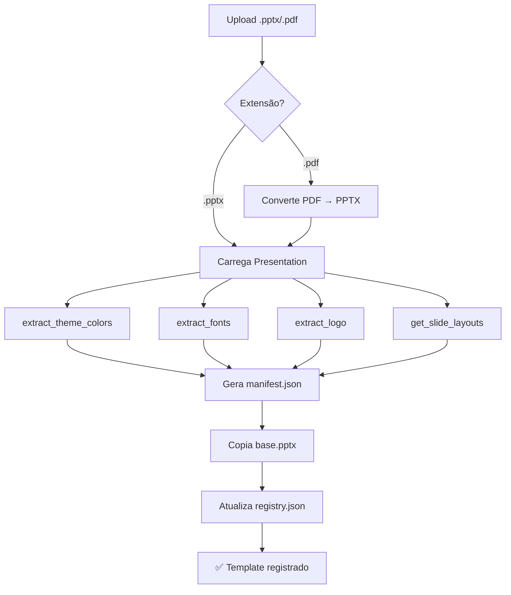
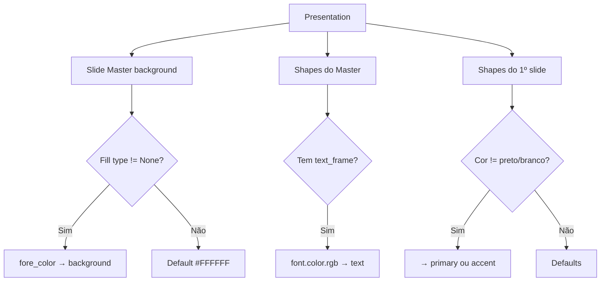

# Fluxograma — Template Management

> Gerado pelo Arqueólogo em 2026-05-11

## Registro de Template

```mermaid
flowchart TD
    A[Upload .pptx/.pdf] --> B{Extensão?}
    B -->|.pdf| C[Converte PDF → PPTX]
    B -->|.pptx| D[Carrega Presentation]
    C --> D
    D --> E[extract_theme_colors]
    D --> F[extract_fonts]
    D --> G[extract_logo]
    D --> H[get_slide_layouts]
    E --> I[Gera manifest.json]
    F --> I
    G --> I
    H --> I
    I --> J[Copia base.pptx]
    J --> K[Atualiza registry.json]
    K --> L[✅ Template registrado]
```

## Extração de Cores (Heurísticas)

```mermaid
flowchart TD
    A[Presentation] --> B[Slide Master background]
    B --> C{Fill type != None?}
    C -->|Sim| D[fore_color → background]
    C -->|Não| E[Default #FFFFFF]
    A --> F[Shapes do Master]
    F --> G{Tem text_frame?}
    G -->|Sim| H[font.color.rgb → text]
    A --> I[Shapes do 1º slide]
    I --> J{Cor != preto/branco?}
    J -->|Sim| K[→ primary ou accent]
    J -->|Não| L[Defaults]
```
