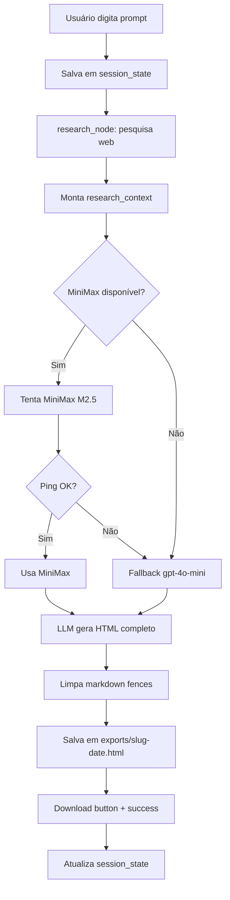
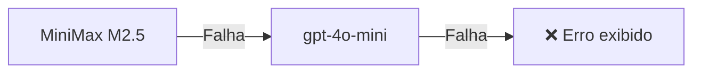

# Fluxograma — UI Chat (app_chat.py)

> Gerado pelo Arqueólogo em 2026-05-11

## Fluxo Principal

```mermaid
flowchart TD
    A[Usuário digita prompt] --> B[Salva em session_state]
    B --> C[research_node: pesquisa web]
    C --> D[Monta research_context]
    D --> E{MiniMax disponível?}
    E -->|Sim| F[Tenta MiniMax M2.5]
    F --> G{Ping OK?}
    G -->|Sim| H[Usa MiniMax]
    G -->|Não| I[Fallback gpt-4o-mini]
    E -->|Não| I
    H --> J[LLM gera HTML completo]
    I --> J
    J --> K[Limpa markdown fences]
    K --> L[Salva em exports/slug-date.html]
    L --> M[Download button + success]
    M --> N[Atualiza session_state]
```

## Fallback Chain

```mermaid
flowchart LR
    A[MiniMax M2.5] -->|Falha| B[gpt-4o-mini]
    B -->|Falha| C[❌ Erro exibido]
```
