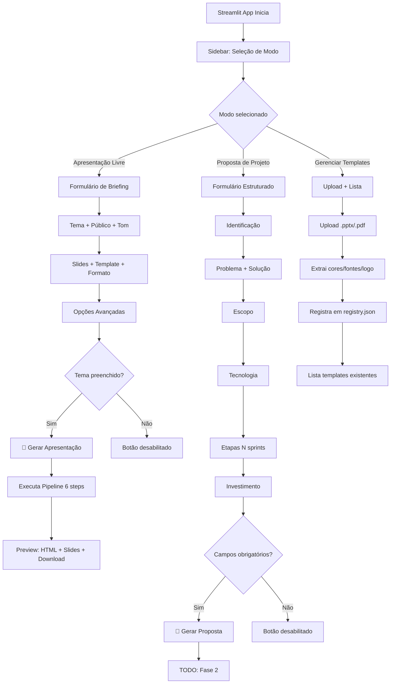
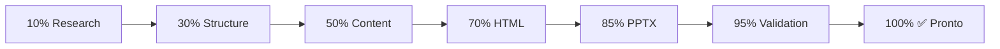

# Fluxograma — UI Forms (app.py)

> Gerado pelo Arqueólogo em 2026-05-11

## Fluxo de Navegação

```mermaid
flowchart TD
    A[Streamlit App Inicia] --> B[Sidebar: Seleção de Modo]
    B --> C{Modo selecionado}
    C -->|Apresentação Livre| D[Formulário de Briefing]
    C -->|Proposta de Projeto| E[Formulário Estruturado]
    C -->|Gerenciar Templates| F[Upload + Lista]

    D --> D1[Tema + Público + Tom]
    D1 --> D2[Slides + Template + Formato]
    D2 --> D3[Opções Avançadas]
    D3 --> D4{Tema preenchido?}
    D4 -->|Sim| D5[🚀 Gerar Apresentação]
    D4 -->|Não| D6[Botão desabilitado]
    D5 --> D7[Executa Pipeline 6 steps]
    D7 --> D8[Preview: HTML + Slides + Download]

    E --> E1[Identificação]
    E1 --> E2[Problema + Solução]
    E2 --> E3[Escopo]
    E3 --> E4[Tecnologia]
    E4 --> E5[Etapas N sprints]
    E5 --> E6[Investimento]
    E6 --> E7{Campos obrigatórios?}
    E7 -->|Sim| E8[🚀 Gerar Proposta]
    E7 -->|Não| E9[Botão desabilitado]
    E8 --> E10[TODO: Fase 2]

    F --> F1[Upload .pptx/.pdf]
    F1 --> F2[Extrai cores/fontes/logo]
    F2 --> F3[Registra em registry.json]
    F3 --> F4[Lista templates existentes]
```

## Geração — Progress Steps

```mermaid
flowchart LR
    A[10% Research] --> B[30% Structure]
    B --> C[50% Content]
    C --> D[70% HTML]
    D --> E[85% PPTX]
    E --> F[95% Validation]
    F --> G[100% ✅ Pronto]
```
