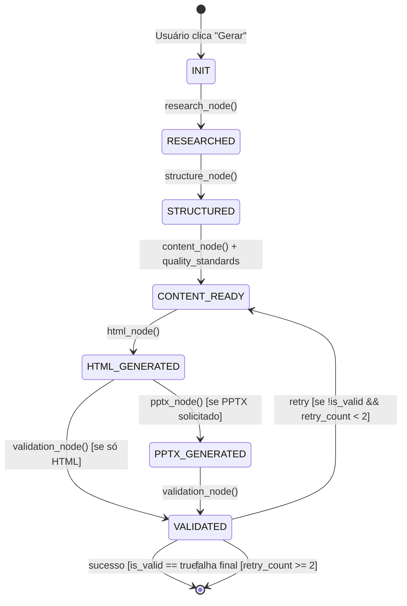
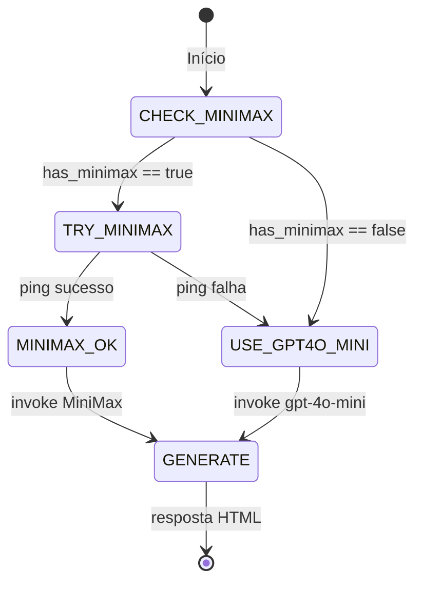
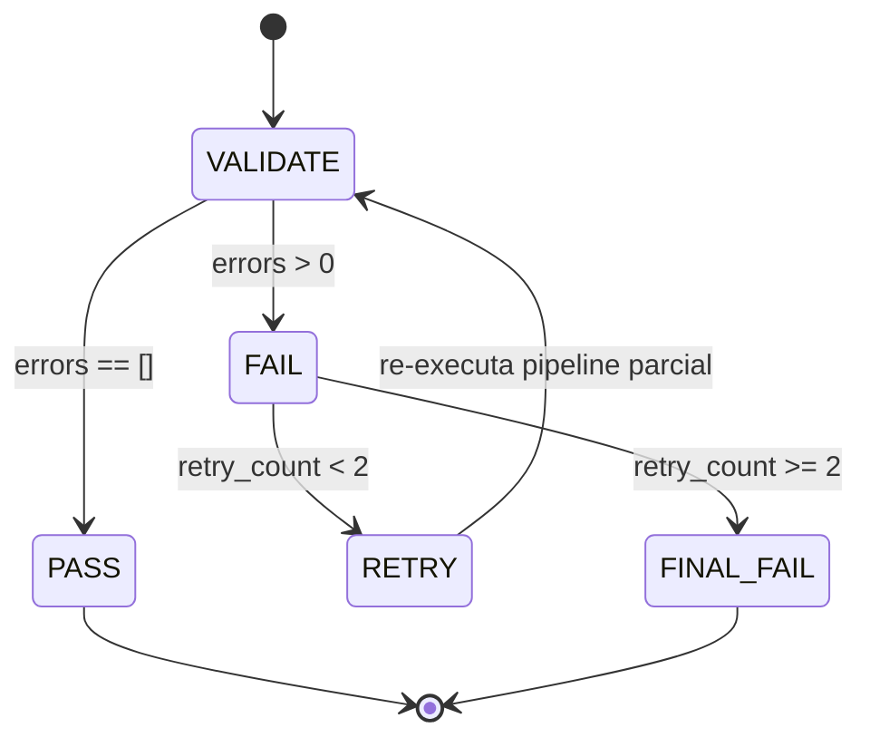
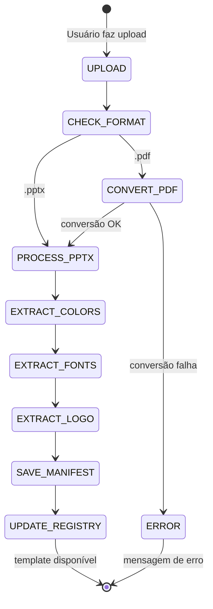
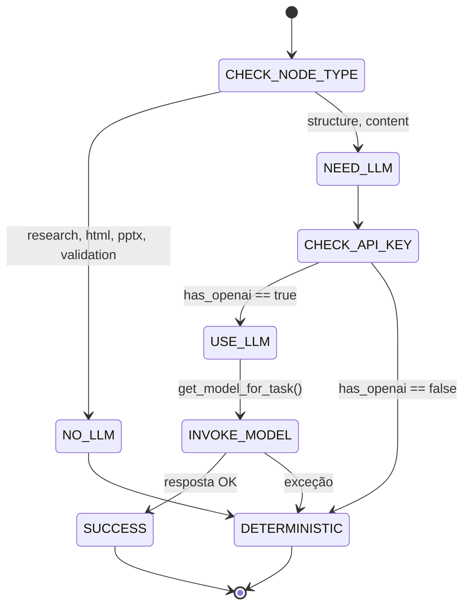

# Máquinas de Estado — Skill_Presentation

> Gerado pelo Detetive em 2026-05-11
> Escala de confiança: 🟢 CONFIRMADO | 🟡 INFERIDO | 🔴 LACUNA

---

## 1. Pipeline de Geração (PresentationState) 🟢

O pipeline é uma máquina de estados linear com retry condicional na validação.

### Estados do Pipeline

| Estado           | Node responsável             | Campos produzidos                                       |
| ---------------- | ---------------------------- | ------------------------------------------------------- |
| `INIT`           | app.py (construção do state) | tema, publico, tom, num_slides, template, formato_saida |
| `RESEARCHED`     | research_node                | research_queries, research_results, selected_data       |
| `STRUCTURED`     | structure_node               | slide_titles                                            |
| `CONTENT_READY`  | content_node                 | slides                                                  |
| `HTML_GENERATED` | html_node                    | html_content, html_path                                 |
| `PPTX_GENERATED` | pptx_node                    | pptx_path                                               |
| `VALIDATED`      | validation_node              | is_valid, error, validation_metrics                     |

### Diagrama de Transições

### Condições de Transição

| De → Para                       | Condição                                      | Confiança |
| ------------------------------- | --------------------------------------------- | --------- | ------------------- | --- |
| INIT → RESEARCHED               | Sempre (tema pode ser vazio → error no state) | 🟢        |
| RESEARCHED → STRUCTURED         | Sempre                                        | 🟢        |
| STRUCTURED → CONTENT_READY      | Sempre (fallback determinístico se LLM falha) | 🟢        |
| CONTENT_READY → HTML_GENERATED  | `slides` não vazio                            | 🟢        |
| HTML_GENERATED → PPTX_GENERATED | `"PPTX (editável)" in formato_saida`          | 🟢        |
| PPTX_GENERATED → VALIDATED      | Sempre                                        | 🟢        |
| VALIDATED → retry               | `!is_valid && _retry_count < 2`               | 🟢        |
| VALIDATED → fim                 | `is_valid                                     |           | \_retry_count >= 2` | 🟢  |

---

## 2. Fallback Chain de LLMs (Modo Chat) 🟢

---

## 3. Validação com Retry 🟢

**Nota**: O retry incrementa `_retry_count` e seta `_should_retry = True`, mas a lógica de re-execução do pipeline parcial não está implementada no `app.py` — o validation_node apenas sinaliza. 🟡

---

## 4. Template Registration 🟢

---

## 5. Seleção de Modelo por Node 🟡

**Nota**: Apesar do `model_selector.py` definir complexidades diferentes por node, `config.py` sempre retorna `gpt-4o-mini`. A máquina de estados real é mais simples que a intencionada.
